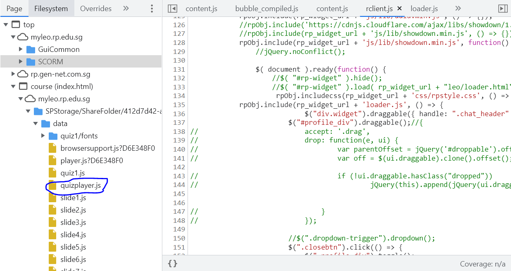

# Hacking the SCORM package

SCORM packages - they are simply the worst things ever right? ...Can't I just cheat on this? Yes you can, here's how I did it.


This writeup is designed as a follow-along beginner tutorial. You do not need to understand programming to follow along with this tutorial, I myself had not even seen Javascript until the day I started trying to make this cheat. I would be describing my entire process of discovering and making the scorm cheat so feel free to skip over the boring parts.

Well it first started when my teacher said he was gonna start grading the scorm packages. Well you know SCORM packages aren't really well regulated... They have unlimited time limits and friends can share the answers among themselves so I was not really happy about it. Then I got really unhappy when I failed the quiz after three attempts on the open ended question. The worst part is I could not even view the correct answers for the socrm quiz afterwards. That's when I finally decided I was gonna hack the scorm. I searched google for 'scorm cheat hack' but although there were many people saying it how easy it was to cheat on scorm packages there were no resources teaching you how to do it. So what did I do then? Well obviously I started out right clicking the page and clicking 'inspect element'.

## Chrome Developer Tools

If you were ever in the computer lab in primary school, changing the page source of wikipedia with 'inspect element' and then trolling your friend with the edited page would the funniest thing.
Well, inspect element is part of Chrome Developer Tools which is the core of this writeup - the debugger and all it's features are simply irreplacable.

Clicking inspect element or pressing f12 (shortcut) on Chrome look something like this. The HTML code under the Elements tab are what makes the basic UI of the website, they are completely irrelavant to us for now so we can ignore them.


<br/><br/>
What we want to look at is the Javascript code working behind the scenes. Javascript is what makes the page dynamic. If you click on some button on the page or perform some gesture with your mouse; all of it is recorded by Javascript and it uses that information to decide how to change information on the page e.g. your total score.
To find the Javascript code, we click the 'Sources' tab.


<br/><br/>
Under the 'Page' tab we can see a few folders. This is where all code that is not in the 'Elements' tab is stored on your browser. From googling, I found that scorm packages run client sided (on your browser). Putting the two together, that would mean our scorm Javascript code is located somewhere here. You might want to stop here and see if you can find our javascript file (filenames with the .js extension) that is running the quiz. 
.  
.  
.  
And here it is:



<br/><br/>
However, all the code in mushed on a few lines and is not very readable for us. Click on the curly braces at the bottom to format the code.


<br/><br/>
Now that we have our formatted Javascript file let's look around and see if we can find anything interesting. You can press ctrl+f to search the Javascript file for any keywords you can think of. For me, I'm thinking of keywords like answers, score,.. Anything that you want to change or modify.

After a few minutes of searching, I found something interesting. `"reviewWithCorrectAnswers"`


<br/><br/>
`"reviewWithCorrectAnswer"` is a literal string (a string of text embedded directly into the code) as it is between two quotation marks. We can see that the variable `a` is being check if it is equal to the string literal `"reviewWithoutCorrectAnswers"` and `"reiviewWithCorrectAnswers"` as there is an `==` operator between them. Meaning the variable `a` was either set to be `"reviewWithoutCorrectAnswers"` or `"reviewWithCorrectAnswers"` earlier on in the code.  
Hm... So that means that all we have to do is find the code that sets something equal to `"reviewWithCorrectAnswers"`. There are 23 search results for `"reviewWithCorrectAnswers"` we can go through each of them to check what the codes do.

So I went through all the results and we find two `"reviewWithCorrectAnswers"` that are used to set something rather than being used for `==` comparison. Let's look at the first one. It is located in a [*function 🖱️*](## "A function is commonly used code that grouped together between `{` and `}` for convenience") called `Bz` . 


As we can see, the function performs some incomprehensible lines of code, which we can assume is checking the state of the quiz and whether or not to display the answers, before [*returning 🖱️*](## "the `return` keyword simply means the output of the function is-") `"reviewing"` or `"reviewWithCorrectAnswers"` or `"reviewWithoutCorrectAnswers"` or `"normal"`  
So now it is clear that somewhere in the code, there is something that is [*calling 🖱️*](## "Calling a function means to run the function code at another location") this function.  
So by editing this function to always return `"reviewWithCorrectAnswers"` this will cause anything that uses this function to check whether or not to display the correct answer to always display the correct answers.

The question is, how do we edit the function?. You see we can't just click into the javascript file and start typing into it like a text editor.  
Well we can just redefine the function. In order to do that we must first understand what are scopes. Scopes are like one way mirrors, someone in a higher scope cannot see someone in a lower scope but someone in a lower scope can see the person in the higher scope. In the context of code, code that is outside a function cannot see variables that are defined inside a function but code that is inside a function can see and use variables from outside that function. Now, `Bz` is a function located inside another function. So in order to change/ modify `Bz' we will need to first get into the same scope as `Bz'. We are currently in global scope, which is the highest scope possible. To get into the same scope as `Bz` we need to use the Debugger.  
Go to line one of the quizplayer.js and click to the left of the line number to set a [*breakpoint 🖱️*](## "A breakpoint is where the debugger pauses the code execution temporarily").  
You should see a blue arrow appear.


<br/><br/>
I will now introduce a technique called "hooking". In essence instead of editing the code manually like a text editor, we send out an automated script to change the code for us. As an anology, let's say I am typing out a long poem but my hacker friend John secretly ran a script on my computer that changes every "I" I type into "You" so as I type, I am puzzled as to why I keep writing in third person. I hope that simpilfies what "hooking" is about.  
This is the code used for "hooking" the `Bz` function.
````
const oldBz = Bz;
Bz = function(){
    return "reviewWithCorrectAnswers";
    oldBz.apply(this, arguments);
}
```
