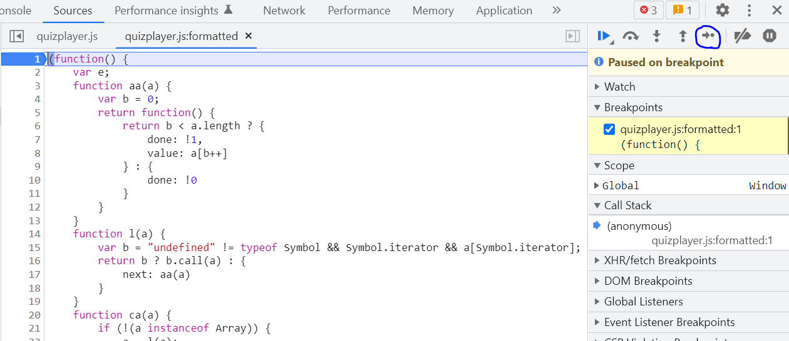

# Hacking the SCORM

SCORM packages - they are simply the worst things ever right? ...Can't I just cheat on this? Yes, and it's super easy.


This writeup is designed as a follow-along beginner tutorial. You only need bare minimum or no programming knowledge to follow along with the first part of this tutorial, I myself had not even seen Javascript until the day I started trying to make this cheat.

Feel free to skip over this paragraph if you just want to know about the cheat. What were my motivations to develop this cheat? It first started when my lecturer said he was gonna start grading the scorm packages. You know SCORM packages aren't really well regulated. They have unlimited time limits and friends can share the answers among themselves so I was not really happy about it. Then I got really unhappy when I failed the quiz after three attempts on the open ended question. The worst part is I could not even view the correct answers for the scorm quiz afterwards. That's when I came to a realization: why not just make the scorm reveal the answers to me? I searched google for 'scorm cheat hack' but although there were many people saying it how easy it was to cheat on scorm packages, there were no resources teaching you how to do it. So what did I do then? Well obviously I started out right clicking the page and clicking 'inspect element'.

## Part 1. Cheating with Chrome Developer Tools

If you were ever in the computer lab in primary school, changing the page source of wikipedia with 'inspect element' and then trolling your friend with the edited page would the funniest thing.
Well, inspect element is part of Chrome Developer Tools which is the core of this writeup - the debugger and all it's features are simply irreplaceable.

First, open up our scorm package on chrome.  
Clicking inspect element or pressing f12 (shortcut) on Chrome look something like this. The HTML code under the Elements tab is what generates the basic UI of the website, it completely irrelevant to us for now so we can ignore it.


<br/><br/>
What we want to look at is the Javascript code working behind the scenes. Javascript is what makes the page dynamic. If you click on some button on the page or perform some gesture with your mouse; all of it is recorded by Javascript and it uses that information to decide how to change information on the page e.g. your total score.
To find the Javascript code, we click the 'Sources' tab. The 'Sources' tab is where all the extra files that were loaded using `src=""` from the 'Elements' tab.


<br/><br/>
Under the 'Page' tab we can see a few folders. SCORM packages run client sided (on your browser) instead of server sided (another computer on the internet). Meaning our SCORM package's Javascript code is located somewhere here. You might want to stop here and see if you can find our javascript file (it has the .js extension) that is running the quiz. 
.  
.  
.  
And here it is:


*If you can't find quizplayer.js I'm sorry, try a different scorm package"
<br/><br/>
However, all the code in mushed together and is not really readable for us. Click on the curly braces at the bottom to format the code.


<br/><br/>
Now that we have our formatted Javascript file let's look around and see if we can find anything interesting. You can press ctrl+f to search the Javascript file for any keywords you can think of. For me, I'm thinking of keywords like 'answer', 'score', etc.. Anything that you want to change or modify.  
.  
.  
.  
After a few minutes of searching, I found something interesting. `"reviewWithCorrectAnswers"`


<br/><br/>
`"reviewWithCorrectAnswer"` is a [*literal 🖱️*](## "A literal is a value that is directly embedded in the code, as opposed to a variable which is assigned a value") and a [*string 🖱️*](## "A string is a string of characters, number, etc. denoted by the two quotation marks surrounding it"). We can see that the [*variable 🖱️*](## "A variable is a container that stores a value. For example, a variable named dog can be equal to 1, or 'hello', or -69, or 'banana' depeneding on what it was assigned") `a` is being check to see if it is equal to the string literal `"reviewWithoutCorrectAnswers"` and `"reiviewWithCorrectAnswers"` as there is an `==` operator between them. Meaning the variable `a` was either set to be `"reviewWithoutCorrectAnswers"` or `"reviewWithCorrectAnswers"` earlier on in the code.  
Hm... So that means that all we have to do is find the code that does that and make it so it always sets to `"reviewWithCorrectAnswers"`. There are 23 search results for `"reviewWithCorrectAnswers"` we can go through each of them to check what the codes do.

So I went through all the results and found two `"reviewWithCorrectAnswers"` that are used to set something rather than being used for `==` comparison.  
Let's look at the first one. It is located in a [*function 🖱️*](## "A function is commonly used code that grouped together between `{` and `}` for convenience and easy usage") called `Bz` (the function name may be different on your scorm package). 


As we can see, the function performs some incomprehensible lines of code, which we can assume is checking the state of the quiz and whether or not to display the answers, before [*returning 🖱️*](## "The `return` keyword, at line 28074, simply means the output of the function is-") either `"reviewing"` or `"reviewWithCorrectAnswers"` or `"reviewWithoutCorrectAnswers"` or `"normal"`.  
So somewhere in the code, there is something that is [*calling 🖱️*](## "Calling a function means to run the function code at another location in the file.") this function to check whether or not to review with the correct answers.  
So by editing this function to always return `"reviewWithCorrectAnswers"` this will cause anything that uses this function to check whether or not to display the correct answer to always display the correct answers.

The question is, how do we edit the function? You see we can't just click into the javascript file and start typing into it like a text editor.

💡 We have to redefine the function through the console. In order to do that we must first understand what are scopes.  
Scopes are like one way mirrors, someone in a higher scope cannot see someone in a lower scope but someone in a lower scope can see the person in the higher scope. In the context of code, code running outside a function cannot use variables that are defined in the function(they can only call the function itself) but the code inside the function can use everything outside. There are some nuances, but this is all I'm capable of explaining.

Now, `Bz` is a function located inside another function. We can see this as there is a one tab indent before the start of `function Bz(a, b) {` at line 28063, if we scroll up to line 1 where there is a `{` and the last line of the file where there is a `}` we can see that the entire Javascript file is encased in a function. This function however does not have a name; it is called an anonymous function. Unlike a normal function that waits to be called, the code in an anonymous function is ran the moment it is defined.  
It looks like this:

```
(function() {
    // Function body
})();
```

So in order to change/modify `Bz` we will need to get into the anonymous function then we will be in the same scope as `Bz`.  
In the console, most of the time we will be in global scope, which is the highest scope possible. To get into the same scope as `Bz` we need to use the Debugger.  
Go to line 1 of the Javascript file and click to the left of the line number to set a [*breakpoint 🖱️*](## "A breakpoint is where the debugger pauses the code execution temporarily").  
You should see a blue arrow appear on the line number.


Reloading (ctrl+r) the page will pause the code at this breakpoint.  
We are still in global scope at this point.  
To go into the function, simply click the 'Step' button



Now you are in the function, all you have to do is redefine the function in the console.  
Copy and paste this into the console and press enter
```
Bz = function(){
    return "reviewWithCorrectAnswers";
}
```
This will make sure the function `Bz` will always return `"reviewWithCorrectAnswers"`.


Now continue the script execution by clicking on the play button


We start the quiz and the correct answers are displayed to us.


<br/><br/>

## Part 2. Making a UserScript with TamperMonkey

Well what if you want to cheat but you don't want to do all the tedious steps every time you have to take the quiz? You can achieve that with TamperMonkey. TamperMonkey is a userscript manager that allows you to run a certain script on the browser the moment you enter a page. At this point you would need to have a basic level of programming knowledge to understand what's going on.

I already made the script so you can [download](https://greasyfork.org/en/scripts/444642-scorm-cheater/code) it along with TamperMonkey to start effortlessly cheating.

Cheating without the debugger is more complicated. We cannot set a breakpoint with a userscript to get in the same scope of the `Bz` function. We also cannot reference the anonymous function as it has no name.

I will now introduce a game hacking technique called "hooking". Essentially, we are injecting some code inside the body of the hooked function.  
What we are hooking are common global functions that will commonly be used. such as `String.prototype.split` or `Array.prototype.push()`. Really anything thing that starts with a datatype followed by `.prototype` then a function/method of that datatype like `.split()` or `.push()`
This is the code used for hooking the `String.prototype.split` global function.
```
const oldfunction = window.String.prototype.split; // Grab original function
window.String.prototype.split = function(){ // Redefine the function
    // write your code here

    oldfunction.apply(this, arguments); // Use .apply to continue as normal
}
```

`// write your code here` is where we will write our malicious code.

`window` is the global object. Any global function will start off with `window.`.

In this case, `String.prototype` is the blueprint of any string variable that is created. Meaning any string variable created will have a function/method named `split()`. What the method `split()` does is it turns the string into an array. But what it does doesn't matter to us, all we need to know is that it is a global function that is being called from inside of the anonymous function.  
With hooking, we can hook on to a global function, like `String.prototype.split`, that is used inside the anonymous function and from there we can access/modify anything inside the anonymous function. Kind of.

Here is the first instance of `String.prototype.split` in the anonymous function.


`String.prototype` is missing because the variable `a` is an instance of `String.prototype`.

So now you might be thinking, then we can just do this?:

```
const oldsplit = window.String.prototype.split;
window.String.prototype.split = function(){
    // redefine the Bz function
    Bz = function(){
        return "reviewWithCorrectAnswers";
    }
    // continue as per normal
    return oldsplit.apply(this, arguments);
}
```

❌Unfortunately I tried this myself, and it does not work. I think the reason is because the reference to the `Bz` function is obscured somehow. Well I couldn't figure it out so I tried another way.

This is the point where things get complicated.

### arguments.calle.caller

arguments.calle.caller allows you to backtrack on the call stack to get a reference onto previously called functions. Although this method is depreciated, it's extremely useful and we can still make use of it.

### toString()

toString() is a function/method that converts a function reference into it's pure string form. This will allow us to edit the function as a string and convert it back to a function and run it.

### regex

Regex stands for regular expression which a language that specifies a search pattern in text in order to do some complicated searches and matches.

### iframes

iframes are like mini virtualized containers in the webpage (idk what an iframe is, I'm just making it up). In this case, our scorm package is running in an iframe. So in order to run our script in the iframe we need to specify the url to the iframe.  

It can be found by using inspect element on the page and finding the `src=` attribute of the `<iframe >` tag


Here is the code you need to add in the UserScript to make sure it runs in the iframe:
'// @match        https://myleo.rp.edu.sg/SPStorage/ShareFolder/*'

## Final UserScript

This is the final userscript source code that I created.

```
// ==UserScript==
// @match        https://myleo.rp.edu.sg/SPStorage/ShareFolder/*
// @run-at document-start
// ==/UserScript==

let count = 0;
const oldsplit = window.String.prototype.split; // Grab original function
window.String.prototype.split = function(){ // Redefine the function
    if (typeof arguments.callee.caller.caller == 'function' && arguments.callee.caller.caller.toString().includes("reviewWithCorrectAnswers") && count == 0) {
        count = 1;
        let temp = arguments.callee.caller.caller.toString();
        const reg = /var c=[A-Za-z][A-Za-z]\(a\)\,d\=[A-Za-z][A-Za-z]\(c\.settings\(\)\)\;/
        temp = temp.replace(reg, 'return "reviewWithCorrectAnswers";');
        let newfunction = new Function(temp.substring(temp.indexOf('{')+1,temp.lastIndexOf('}')));
        newfunction();
        return;
    }
    return oldsplit.apply(this, arguments); // Use .apply to continue as normal
}
```

Okay let me explain.

### `let count = 0;` `&& count == 0` `count = 1;`

These few codes are to make sure Bz is only redefined once. Since `String.prototype.split` is going to be called thousands of times as it is a common global function.

### `typeof arguments.callee.caller.caller == 'function' && arguments.callee.caller.caller.toString().includes("reviewWithCorrectAnswers")`

`arguments.callee.caller.caller` refers to the anonymous function embodying the quizplayer.js file
This basically makes sure that the `String.prototype.split` call came from the anonymous function in quizplayer.js instead of another random call from another file.

### `let temp = arguments.callee.caller.caller.toString();`

This stores the string of our anonymous function in a variable `temp`

### `/var c=[A-Za-z][A-Za-z]\(a\)\,d\=[A-Za-z][A-Za-z]\(c\.settings\(\)\)\;/`

This is the regex string to search for a specific pattern.  
The pattern it is finding is the one highlighted below:


Note the reason why we need to use regex in the first place is because the names of the variables and functions change throughout different scorm packages. The function `Bz` maybe be named a differently e.g. `Ca`. Therefore the regex string takes into account these changes and finds the pattern in the code.

### `temp = temp.replace(reg, 'return "reviewWithCorrectAnswers";');`

This replaces the string found with regex (highlighted in the above image) with `return "reviewWithCorrectAnswers"`

### `let newfunction = new Function(temp.substring(temp.indexOf('{')+1,temp.lastIndexOf('}')));`

This creates a fake anonymous function copy of the previous anonymous function but we have edited the `Bz` function to `return "reviewWithCorrectAnswers"`

## Conclusion

As you can see even a noob like me was able to do something so complicated anyone can do it too. You just have to put in the hours into google search like I did.

Good luck🍀

## Bonus challenge

Try manipulating Javascript to get an absurd score for your quiz like 999 or something.  
JK don't do it you'll get banned.
